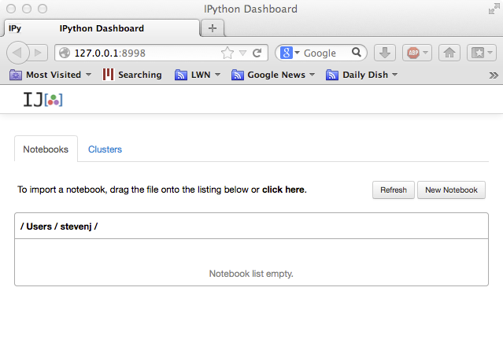
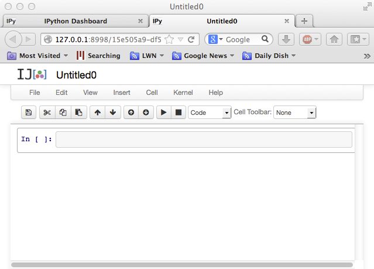
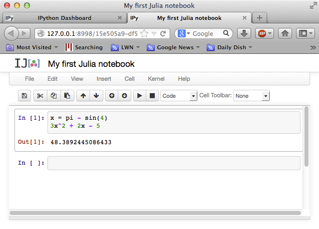
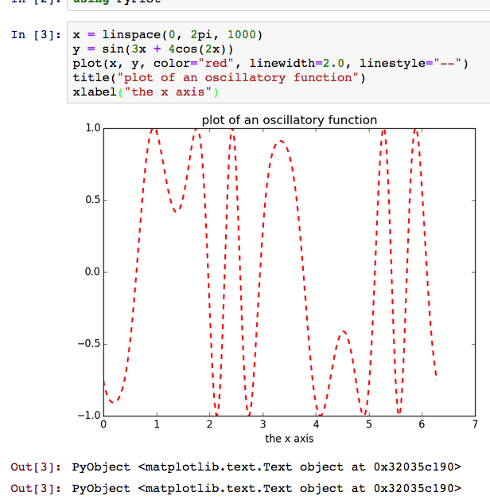

Julia for Numerical Computation in MIT Courses
==============================================

Several MIT courses involving numerical computation, including
[18.06](https://github.com/mitmath/1806),
[18.303](https://github.com/mitmath/18303),
[18.330](http://math.mit.edu/classes/18.330/),
[18.335/6.337](https://github.com/mitmath/18335),
[18.337/6.338](http://beowulf.csail.mit.edu/18.337),
and
[18.338](https://github.com/alanedelman/18.338-Eigenvalues-of-Random-Matrices),
are
beginning to use [Julia](http://julialang.org/), a fairly new language
for technical computing.  This page is intended to supplement the
[Julia documentation](http://docs.julialang.org/en/latest/) with some
simple tutorials on installing and using Julia targeted at MIT
students.  See also our [Julia
cheatsheet](Julia-cheatsheet.pdf) listing
a few basic commands, and [various Julia tutorials online](https://julialang.org/learning/).

In particular, we will be using Julia in the
[IJulia](https://github.com/JuliaLang/IJulia.jl) browser-based
enviroment, which leverages your web browser and
[Jupyter](https://jupyter.org/) to provide a rich environment
combining code, graphics, formatted text, and even equations, with
sophisticated plots via [Matplotlib](http://matplotlib.org/).

You can also look at the Jupyter notebook from the [fall 2020 tutorial](Tutorial.ipynb), as well as the [tutorial video (MIT only)](https://mit.zoom.us/rec/share/FcA8_JB8vZ-3FmX6_x2qaeRMk0aCOkFl9cMrba1rhQYDDv8TNeatMqTh7eXabBHq.7AQu81CA0eiu2z7g?startTime=1599594382000).

## Why Julia?

Julia is relatively new
high-level free/open-source language for numerical computing in the
same spirit, with a rich set of built-in types and libraries for
working with linear algebra and other types of computations, with a
syntax that is superficially reminiscent of Matlab's.
Basically, we are using Julia because, unlike Matlab or Python or R, it
**scales better to real computational problems** — you can write performance-critical
"inner loops" in Julia, whereas similar tasks in other high-level languages
often require one to drop down to C or similar low-level languages.  (See e.g. [this 6.172 lecture](https://bit.ly/2QUrgB4) on performance in Julia vs. Python.) Because of
this, we are using Julia more and more in our own research, and we want to **teach
using software tools that we really employ ourselves**.

## Installing Julia and IJulia

First, [download the 1.5 release of Julia](https://julialang.org/downloads/) run the installer.
Then run the Julia application (double-click on
it); a window with a `julia>` prompt will appear.  At the `julia>` prompt,
type a `]` (close square bracket) to get a [Julia package prompt `pkg>`](https://docs.julialang.org/en/v1/stdlib/Pkg/),
where you can type

```jl
(v1.5) pkg> add IJulia
```

You may also want to install these packages, which we tend to
use in a lot of the lecture materials:
```jl
(v1.5) pkg> add Interact PyPlot Plots
```
(You can install packages later as you need them using the same interface, of course.  Thousands of other packages can be found on [JuliaHub](https://juliahub.com/).)

Switch back to the `julia>` prompt by hitting backspace or ctrl-C, and then
you can launch the notebook by running
```jl
julia> using IJulia

julia> notebook()
```
as is also described below.

(An alternative is to download the [JuliaPro package](https://juliacomputing.com/products/juliapro.html#comparison),
which includes Julia, IJulia, the [Juno IDE](http://junolab.org/) based on the [Atom editor](https://atom.io/),
and a number of packages pre-installed.)

### Troubleshooting:

* If you ran into a problem with the above steps, after fixing the problem you can type `build` at the `pkg>` prompt to try to rerun the install scripts.
* If you tried it a while ago, try running `update` at the `pkg>` prompt and try again:
  this will fetch the latest versions of the Julia packages in case
  the problem you saw was fixed.  Run `build IJulia` at the `pkg>` prompt if your Julia version may have changed.  If this doesn't work, try just deleting the whole `.julia` directory in your home directory (on Windows, it is called `AppData\Roaming\julia\packages` in your home directory) and re-adding the packages.
* On MacOS, you need MacOS 10.8 or later.
* If the notebook opens up, but doesn't respond (the input label is `In[*]` indefinitely), try creating a new Python notebook (not Julia) from the `New` button in the Jupyter dashboard, to see if `1+1` works in Python.  If it is the same problem, then probably you have a [firewall running](https://github.com/ipython/ipython/issues/2499) on your machine (this is common on Windows) and you need to disable the firewall or at least to allow the IP address 127.0.0.1.  (For the [Sophos](https://en.wikipedia.org/wiki/Sophos) endpoint security software, go to "Configure Anti-Virus and HIPS", select "Authorization" and then "Websites", and add 127.0.0.1 to "Authorized websites"; finally, restart your computer.)

## Other Julia environments

### Pluto.jl

A different interactive-computing environment for Julia is [Pluto.jl](https://github.com/fonsp/Pluto.jl), which runs in the browser like Jupyter but is **more oriented towards "live" interaction** where updating one piece of code *automatically re-runs anything affected* by that change.   Running Julia is as easy as:

```jl
pkg> add Pluto

julia> using Pluto

julia> Pluto.run()
```

### VSCode

For writing larger programs, modules, and packages (as opposed to little interactive snippets), you'll want to start putting code into files and modules, and use a more full-featured code-editing environment.  A popular choice is the free/cross-platform [Visual Studio Code (VSCode)](https://code.visualstudio.com/) editor, which has a [Julia VSCode plugin](https://www.julia-vscode.org/) to provide a full-featured integrated development environment (IDE).

### Other Editors

Of course, there is also good support for editing Julia in many other programs, such as [Emacs](https://github.com/JuliaEditorSupport/julia-emacs), [Vim](https://github.com/JuliaEditorSupport/julia-vim), [Atom](https://github.com/JuliaEditorSupport/atom-language-julia), and [so forth](https://github.com/JuliaEditorSupport).

## Julia on MIT Athena

Julia is also installed on MIT's [Athena Computing
Environment](http://ist.mit.edu/athena).  Any MIT student can use the
computers in the [Athena Clusters](http://ist.mit.edu/athena-clusters)
on campus, and you can also log in remotely to `athena.dialup.mit.edu`
via [ssh](https://en.wikipedia.org/wiki/Secure_Shell).

In the terminal of an Athena machine, type:
```
add julia
```
to load the Julia and IPython software locker.

The *first* time you use Julia on Athena, you will need to set up IJulia: run `julia`, and at the `julia>` prompt, type `]` to get a `pkg>` prompt and type
```jl
(v1.2) pkg> update
(v1.2) pkg> add IJulia PyPlot Interact
```

Thereafter, you can run the notebook as below.

#### Remote access to Julia on Athena.

If you are [logging in
remotely](http://kb.mit.edu/confluence/pages/viewpage.action?pageId=3907166)
to `athena.dialup.mit.edu`, you can use a trick called "port
forwarding" to run IJulia in your local web browser (MUCH faster and
nicer than running a web browser remotely over X Windows).   The steps are:

* Log in by typing `ssh -L 8778:localhost:8998 athena.dialup.mit.edu` into your terminal.  (This works with Macs and GNU/Linux; how you do it on Windows will depend upon your ssh client and whether it supports port forwarding: you want to forward port 8998 on the remote machine to port 8778 on `localhost`.)

* `add julia` and make sure IJulia is installed as above.

* Quit Julia and type (at the Athena prompt): `jupyter notebook --no-browser`  ... unfortunately, this won't work until Athena installs a newer version of `jupyter`.

* In your ordinary web browser, type `localhost:8778` in the address bar.

You should see the IPython dashboard for IJulia running on Athena (creating a new notebook will create the file in your Athena account).

## Updating Julia and IJulia

Julia is improving rapidly, so it won't be long before you want to
update to a more recent version.  The same is true of Julia add-on
packages like PyPlot.  To update the packages only, keeping Julia itself
the same, just run:
```jl
(v1.3) pkg> update
```
at the Julia `pkg>` prompt after typing `]`; you can also run `] update` in IJulia.

If you download and install a new version of Julia from the Julia web
site, you will also probably want to update the packages with
`update` (in case newer versions of the packages are required
for the most recent Julia).  In any case, if you install a new Julia
binary (or do anything that changes the location of Julia on your
computer), you *must* update the IJulia installation (to tell IPython
where to find the new Julia) by running `build` at the
Julia `pkg>` prompt line (not in IJulia).

## Running Julia in the IJulia Notebook

Once you have followed the installation steps above, open up the
Julia command line (run `julia` or double-click the `julia` program)
and run
```jl
julia> using IJulia
julia> notebook()
```
(You will have to leave the Julia command-line window open in order
to keep the IJulia/Jupyter process running.  Alternatively, you can run `notebook(detached=true)` if you want to run the Jupyter server as a background process, at which point you can close the Julia command line, but then if you
ever want to restart the Jupyter server you will need to kill it manually.

A "dashboard" window like this should open in your web browser (at address `localhost:8888`, which you can return to at any time as long as the `notebook()` server is running; I usually keep it running all the time):



Now, click on the *New* button and select the *Julia* option to start a new "notebook".  A notebook will combine code, computed results, formatted text, and
images; for example, you might use one notebook for each problem set.
The notebook window that opens will look something like:



You can click the "Untitled" at the top to change the name, e.g. to
"My first Julia notebook".  You can enter Julia code at the `In[ ]`
prompt, and hit **shift-return** to execute it and see the results.
If you hit **return** *without* the shift key, it will add additional
lines to a single input cell.  For example, we can [define a variable](http://docs.julialang.org/en/latest/manual/variables/)
`x` (using the built-in constant `pi` and the built-in function
`sin`), and then evaluate a polynomial `3x^2 + 2x - 5` in terms of `x`
(note that, unlike Matlab or Python, we don't have to type `3*x^2` if
we don't want to: a number followed by a variable is automatically
interpreted as multiplication without having to type `*`):



The result that is printed (in `Out[1]`) is the *last* expression from
the input cell, i.e. the polynomial.  If you want to see the value of
`x`, for example, you could simply type `x` at the second `In[ ]` prompt
and hit shift-return.

See, for example, the [mathematical operations in the Julia
manual](http://docs.julialang.org/en/latest/manual/mathematical-operations/)
for many more basic math functions.

## Plotting

There are several plotting packages available for Julia.  If you
followed the installation instructions, above, you already have one
full-featured Matlab-like plotting package installed:
[PyPlot](https://github.com/stevengj/PyPlot.jl), which is simply a
wrapper around Python's amazing [Matplotlib](http://matplotlib.org/) library.

To start using PyPlot to make plots in Julia, first type `using
PyPlot` at an input prompt and hit shift-enter.  `using` is the Julia
command to load an [external
module](http://docs.julialang.org/en/latest/manual/modules/) (which
must usually [be
installed](http://docs.julialang.org/en/latest/manual/packages/)
first, e.g. by the `] add PyPlot` command from the installation
instructions above).  The *very first* time you do `using PyPlot`, it will
take some time: the module and its dependencies will be
"precompiled" so that in subsequent Julia sessions it will load quickly.

Then, you can type any of the [commands from
Matplotlib](http://matplotlib.org/api/pyplot_api.html), which includes
equivalents for most of the Matlab plotting functions.  For example:



## Printing/exporting Notebooks

Currently, printing a notebook from the browser's *Print* command <a
href="https://github.com/ipython/ipython/issues/4196">can be somewhat problematic</a>.  There are four solutions:

* At the top of the notebook, click on the *File* menu (in the
  notebook, *not* the browser's global menu bar), and choose **Print
  Preview**.  This should open up a window/tab that you can print
  normally.

* For turning in homework, a class may allow you to submit the notebook file
  (`.ipynb` file) electronically (the graders will handle printing).  You can save a notebook file in a different location by choosing **Download as** from the notebook's *File* menu.

* The highest-quality printed output is produced by IPython's
  [nbconvert](http://ipython.org/ipython-doc/rel-1.0.0/interactive/nbconvert.html)
  utility.  For example, if you have a file `mynotebook.ipynb`, you
  can run `ipython nbconvert mynotebook.ipynb` to convert it to an
  HTML file that you can open and print in your web browser.  This
  requires you to install [IPython](http://ipython.org/install.html),
  [Sphinx](http://sphinx-doc.org/latest/install.html) (which is
  automatically installed with the Anaconda Python/IPython distribution), and
  [Pandoc](http://johnmacfarlane.net/pandoc/installing.html) on your
  computer.

* If you post your notebook in a Dropbox account or in some other
  web-accessible location, you can paste the URL into the online [nbviewer](http://nbviewer.ipython.org/) to get a printable version.
